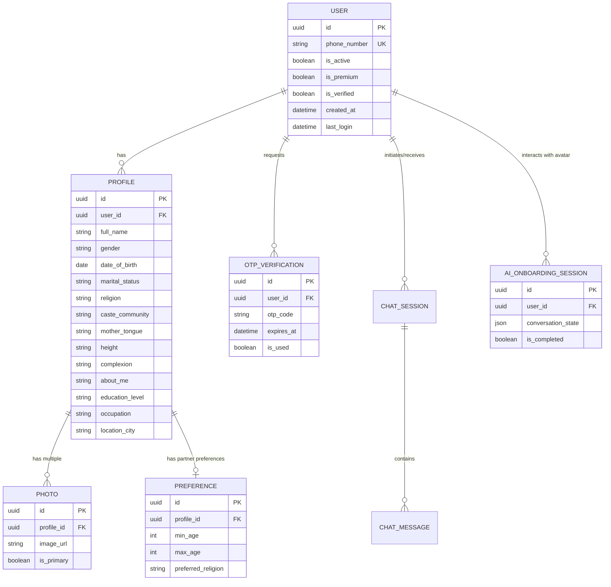

# HaldiMahendi - AI Matrimonial Platform

Welcome to the HaldiMahendi repository! This project consists of a decoupled architecture with a Next.js frontend and a fully functioning Django backend.

## 🚀 For the Frontend Developer

This backend is designed to be completely API-driven (REST + WebSockets) to support a dynamic, AI-powered conversational avatar onboarding flow. 

### Backend Setup (Local Development)
If you need to run the backend locally to test your frontend:
1. Navigate to the `backend` folder.
2. Activate the virtual environment: `.\venv\Scripts\activate` (Windows) or `source venv/bin/activate` (Mac/Linux).
3. Ensure you have a `.env` file in `backend/` with `OPENAI_API_KEY=your_key` and `ELEVENLABS_API_KEY=your_key` (if testing the avatar features).
4. Run the server: `python manage.py runserver`
5. The API will be available at `http://localhost:8000/api/v1/`.

---

### 📚 API Documentation

#### 1. Authentication (Phone OTP)
We use a password-less, OTP-based authentication system.

*   **Send OTP**
    *   **Endpoint:** `POST /api/v1/auth/send-otp/`
    *   **Payload:** `{ "phone_number": "+919876543210" }`
    *   **Response:** `{ "status": "OTP sent successfully." }`
*   **Verify OTP & Login**
    *   **Endpoint:** `POST /api/v1/auth/verify-otp/`
    *   **Payload:** `{ "phone_number": "+919876543210", "otp": "123456" }`
    *   **Response:** `{ "access": "eyJ...", "refresh": "eyJ...", "is_new_user": true/false }`
    *   *Note: Save the `access` token. Pass it as a Bearer token in the `Authorization` header for all protected routes.*

#### 2. Bio-Data Parsing (AI OCR)
Automatically parses uploaded Bio-Data documents into structured JSON.

*   **Endpoint:** `POST /api/v1/profile/biodata/parse/`
*   **Headers:** `Authorization: Bearer <your_access_token>`
*   **Content-Type:** `multipart/form-data`
*   **Payload:** `file` (a JPG, PNG, or PDF file) OR `text` (raw pasted string).
*   **Response:**
    ```json
    {
      "status": "success",
      "raw_extracted_text": "...",
      "structured_data": {
        "full_name": "Sourabh Bansal",
        "date_of_birth": "1998-08-17",
        "height": "6'0\"",
        "complexion": "Fair",
        "education_level": "Graduation (BBA)",
        "occupation": "Business",
        "family_details": "Father: Businessman...",
        "expectations": "Looking for a caring partner..."
      }
    }
    ```
    *Frontend UI Note: You should present this `structured_data` to the user in a form to verify before calling a (future) profile save endpoint.*

#### 3. Real-Time AI Avatar Onboarding (WebSockets)
The core feature: A conversational flow with a 3D Avatar (Priya) to gather profile details interactively.

*   **WebSocket URL:** `ws://localhost:8000/ws/avatar/onboarding/?token=<your_access_token>`
*   **Frontend Action (Sending Audio/Text):**
    You should record the user's mic, run it through your preferred STT (e.g., Deepgram SDK on the frontend), and send the resulting transcribed text over the socket:
    ```json
    { "text": "Hi Priya, my name is Sourabh", "language": "en" }
    ```
*   **Backend Response (Receiving Avatar Audio):**
    The backend will process the text with GPT-4o, generate an audio response via ElevenLabs, and stream it back:
    ```json
    { 
      "type": "avatar_response", 
      "text": "Nice to meet you, Sourabh. What is your profession?", 
      "audio_base64": "UklGRjT2... (base64 encoded audio string)" 
    }
    ```
    *Frontend UI Note: Decode the `audio_base64` string to a blob and play it, while syncing the Avatar's lip movements.*

#### 4. Matchmaking & Search
*   **Endpoint:** `GET /api/v1/matches/search/`
*   **Headers:** `Authorization: Bearer <your_access_token>`
*   **Query Params:** `?q=search_term&gender=male&religion=hindu`
*   **Response:** Returns a JSON array of matching profiles.

---

---

### 🎨 Frontend Design & Aesthetics Guidelines
To ensure this platform feels like a next-generation, premium product (and not a generic Shaadi.com clone), please adhere to the following design principles:
1. **Rich & Premium Aesthetics:** Avoid generic primary colors (plain red/blue). Use curated, harmonious color palettes (e.g., tailored HSL colors, sleek dark modes, glassmorphism).
2. **Modern Typography:** Do not use browser defaults. Use modern Google Fonts like `Inter`, `Outfit`, or `Plus Jakarta Sans`.
3. **Dynamic & Alive:** Implement micro-animations (using Framer Motion or GSAP) for hover states, page transitions, and buttons. The UI must feel responsive and engaging.
4. **Gamification:** The onboarding process should feel like a game or a friendly chat, avoiding massive, daunting forms.

---

### 🗺️ Control Flow & Required Pages
Here is the core page flow you need to build in Next.js:

1. **Landing Page (`/`)**
   - High-end hero section with a compelling call-to-action (CTA).
   - "Get Started" button that opens the OTP login modal.
2. **Authentication Flow (OTP Modal / Page)**
   - **Step 1:** Enter Phone Number -> Calls `POST /auth/send-otp/`.
   - **Step 2:** Enter 6-digit OTP -> Calls `POST /auth/verify-otp/`. Stores JWT in local storage/cookies.
3. **Bio-Data Upload Page (`/onboarding/upload`)**
   - Drag-and-drop zone for PDF/JPG bio-data or a text area for pasting.
   - Calls `POST /profile/biodata/parse/` and displays a beautiful "Review Details" card with the extracted structured JSON.
4. **AI Avatar Onboarding (`/onboarding/avatar`)**
   - *The centerpiece of the app.*
   - Loads the 3D Avatar (using Three.js / `@react-three/fiber`).
   - Connects to the WebSocket `ws://.../ws/avatar/onboarding/`.
   - UI controls: Mute mic, language switcher (EN/HI), and a fallback text chat window.
   - The user speaks, STT processes it, sends text via socket. The socket returns text and `audio_base64`. The frontend plays the audio and syncs the 3D model's lips.
5. **Main Dashboard / Match Search (`/dashboard`)**
   - Displays recommended profiles.
   - A filter sidebar calling `GET /matches/search/` to search by religion, gender, age, etc.
6. **Profile Settings (`/profile`)**
   - Allow users to edit their parsed details and manage photos.

---

### 🗄️ Entity Relationship Diagram (ERD)
Here is the database schema that the backend is running. This will help you understand the relationships between the data you are fetching.



Happy building! Let the backend team know if you need any adjustments to the payloads.
