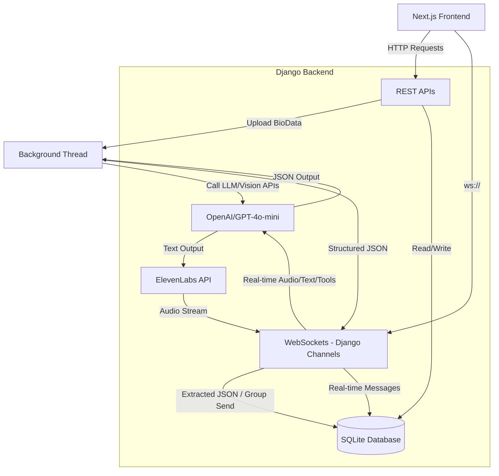

# Haldi Mahendi

Welcome to the Haldi Mahendi project repository!

This project is currently in **active development mode**. We are building a decoupled application using a Django backend and a Next.js frontend.

## Architecture

*   **Backend:** Django (Python) - Serves as the API provider.
*   **Frontend:** Next.js (React) - Consumes the API and provides the user interface using Tailwind CSS v4, Shadcn UI, and Redux Toolkit.
*   **Database:** SQLite - Currently used for rapid local development. We will switch to a more robust database (like PostgreSQL or MySQL) in the future for staging/production deployments.

## Implemented Features

*   **Authentication:** Send & Verify OTP flow using a REST API (using JWTs managed in Redux).
*   **AI Biodata Parsing (Drag & Drop):** Asynchronously upload a bio-data image, PDF, or Word document to extract structured JSON data via LLM.
*   **Profile Management:** Endpoints to fetch and comprehensively update user profiles, including support for uploading multiple profile photos.
*   **Search Engine:** Basic searching and filtering logic for profiles in the matchmaking dashboard.
*   **Real-time Chat (Pending):** Django Channels ASGI configuration supporting WebSocket connections.
*   **Interactive AI Avatar (Pending):** Real-time conversational voice avatar using Beyond Presence (frontend), ElevenLabs (TTS), and OpenAI.

## Architecture & System Flow



## Getting Started (Local Development)

### Prerequisites

*   Python 3.10+
*   Node.js 18+

### Backend Setup

1.  Navigate to the `backend` directory.
2.  Activate the virtual environment: `.\venv\Scripts\activate` (Windows)
3.  Install dependencies: `pip install -r requirements.txt` (Make sure to run `pip install django-cors-headers python-docx` if missing)
4.  Create a `.env` file in the `backend/` directory and configure the SMS API credentials:
    ```env
    SMS_API_URL=https://login.smsmedia.org/app/smsapi/index.php
    SMS_API_KEY=your_key
    SMS_API_CAMPAIGN=your_campaign
    SMS_API_ROUTE_ID=your_route
    SMS_API_SENDER_ID=your_senderid
    SMS_API_TEMPLATE_ID=your_template_id
    SMS_API_PE_ID=your_pe_id
    ```
5.  Run migrations: `python manage.py migrate`
6.  Start the server: `python manage.py runserver` (Runs on `http://127.0.0.1:8000`)

### Frontend Setup

1.  Navigate to the `frontend` directory.
2.  Install dependencies: `npm install`
3.  Create a `.env.local` file in the `frontend/` directory:
    ```env
    NEXT_PUBLIC_API_URL=http://localhost:8000/api/v1/
    ```
4.  Start the development server: `npm run dev` (Usually runs on `http://localhost:3001` or `3000`)

---

## API Reference Guide

### 1. Authentication: Send OTP
*   **Endpoint:** `POST /api/v1/auth/send-otp/`
*   **Payload:** `{"phone_number": "+1234567890"}`
*   **Note:** Using `+910000000000` will return a `mock_otp` in the JSON response for local testing.

### 2. Authentication: Verify OTP
*   **Endpoint:** `POST /api/v1/auth/verify-otp/`
*   **Payload:** `{"phone_number": "+1234567890", "otp": "123456"}`
*   **Response:** `{ "access": "jwt", "refresh": "jwt", "is_new_user": true }`

### 3. Biodata Upload
*   **Endpoint:** `POST /api/v1/profile/biodata/upload/`
*   **Payload (multipart/form-data):** `file`: The `.docx` or PDF file.

### 4. View My Profile
*   **Endpoint:** `GET /api/v1/profile/me/`
*   **Response:** Detailed parsed information of the user.

### 5. Search Profiles / Matchmaking Dashboard
*   **Endpoint:** `GET /api/v1/matches/search/?q=term` OR `GET /api/v1/matches/recommended/`
*   **Response:** List of matching users.

### 6. Chat WebSockets (Upcoming)
*   **Endpoint:** `ws://127.0.0.1:8000/ws/chat/<session_id>/`
