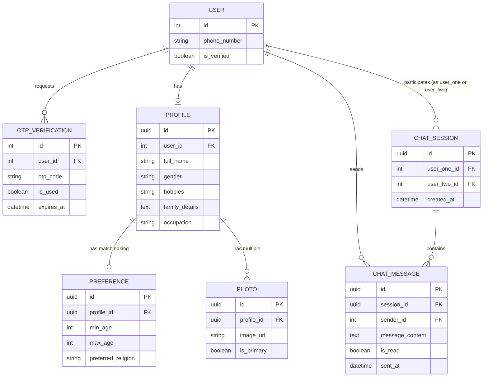

# Haldi Mahendi

Welcome to the Haldi Mahendi project repository!

This project is currently in **active development mode**. We are building a decoupled application using a Django backend and a Next.js frontend.

## Architecture

*   **Backend:** Django (Python) - Serves as the API provider.
*   **Frontend:** Next.js (React) - Consumes the API and provides the user interface.
*   **Database:** SQLite - Currently used for rapid local development. We will switch to a more robust database (like PostgreSQL or MySQL) in the future for staging/production deployments.

## Development Workflow

1.  **AI-Assisted Development:** We are leveraging AI tools to rapidly prototype, develop, and test new APIs and features.
2.  **Frontend/Backend Decoupling:** The frontend developer will exclusively use the `FRONTEND_GUIDE.md` for integrating with the backend. They do not need to understand Django internals.
3.  **Future Deployment:** Once features are stable locally, they will be showcased and then migrated to a production-ready environment.

## Implemented Features

*   **Authentication:** Send & Verify OTP flow using a REST API.
*   **AI Biodata Parsing:** Upload a bio-data image or PDF to extract structured JSON data via LLM (OpenAI/Google Vision).
*   **Profile Management:** Endpoints to fetch and comprehensively update user profiles, including support for uploading multiple profile photos.
*   **Search Engine:** Basic searching and filtering logic for profiles.
*   **Real-time Chat:** Django Channels ASGI configuration supporting WebSocket connections, alongside REST APIs to start sessions and fetch message history.

## Architecture & System Flow

```mermaid
graph TD
    Client[Next.js Frontend]
    
    sublayer[Django Backend]
        REST[REST APIs]
        WS[WebSockets - Django Channels]
        DB[(SQLite Database)]
        LLM[OpenAI/Vision API]
    end

    Client -- HTTP Requests --> REST
    Client -- ws:// --> WS
    
    REST -- Upload BioData --> LLM
    LLM -- JSON Output --> REST
    
    REST -- Read/Write --> DB
    WS -- Real-time Messages --> DB
```

## Database Schema (ER Diagram)



## Getting Started (Local Development)

### Prerequisites

*   Python 3.10+
*   Node.js 18+

### Backend Setup

1.  Navigate to the `backend` directory.
2.  Activate the virtual environment: `.\venv\Scripts\activate` (Windows)
3.  Install dependencies (if new ones were added): `pip install -r requirements.txt`
4.  Run migrations: `python manage.py migrate`
5.  Start the server: `python manage.py runserver`

### Frontend Setup

1.  Navigate to the `frontend` directory.
2.  Install dependencies: `npm install`
3.  Start the development server: `npm run dev`

## Resources

*   `FRONTEND_GUIDE.md`: The primary resource for the frontend team regarding API contracts and integration details.
